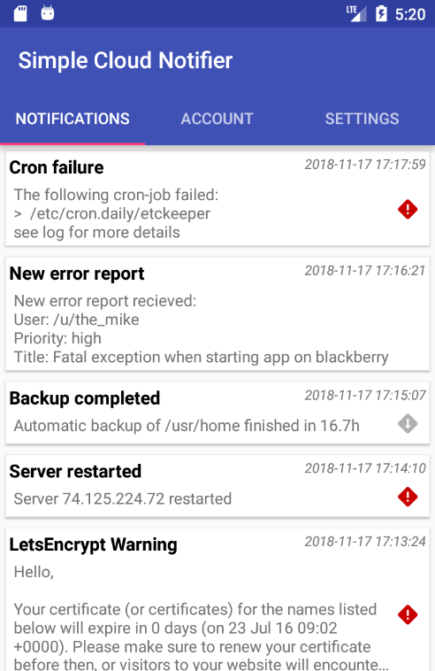
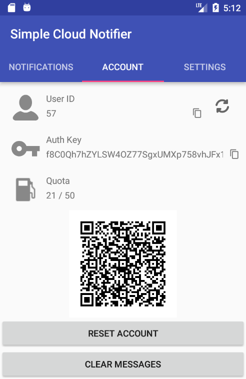
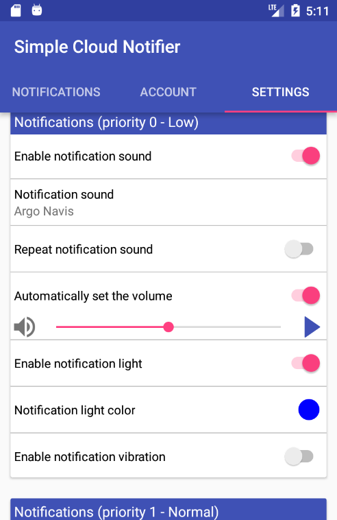

SimpleCloudNotifier 
===================

> SimpleCloudNotifier is an app to display messages that you can send to your phone with simple POST requests.
> 
> After you start the app it generates a UserID and a UserSecret.
> Now you can send your message to https://simplecloudnotifier.blackforestbytes.com/send.php and a notification will be pushed to your phone.
> (see https://simplecloudnotifier.blackforestbytes.com/ for an example with curl)
> 
> 
> Use it to
>  - send yourself automated messages from cron jobs
>  - notify yourself when long-running scripts finish
>  - send server error messages directly to your phone
>  - integrate with other online services
> 
> The possibilities are endless*
> 
> \* Disclaimer: Developer does not actually guarantee endless possibilities

  